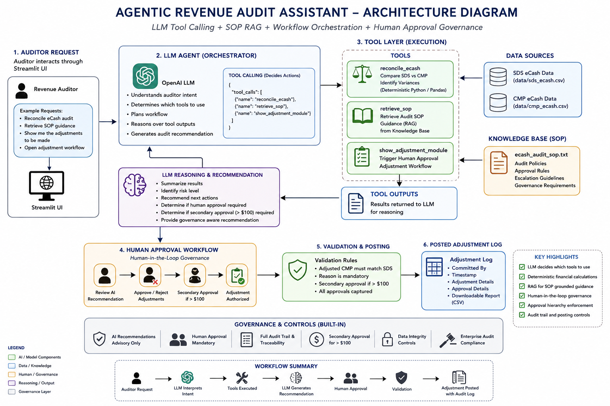
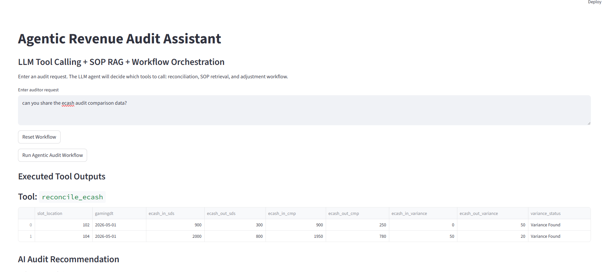
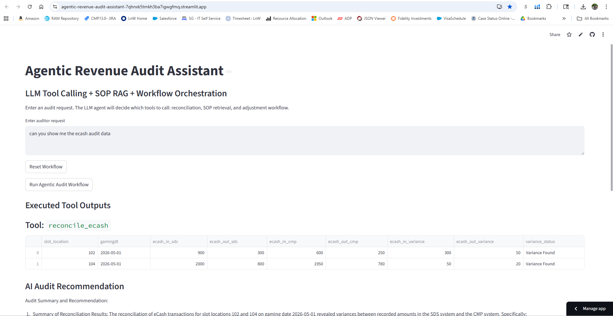
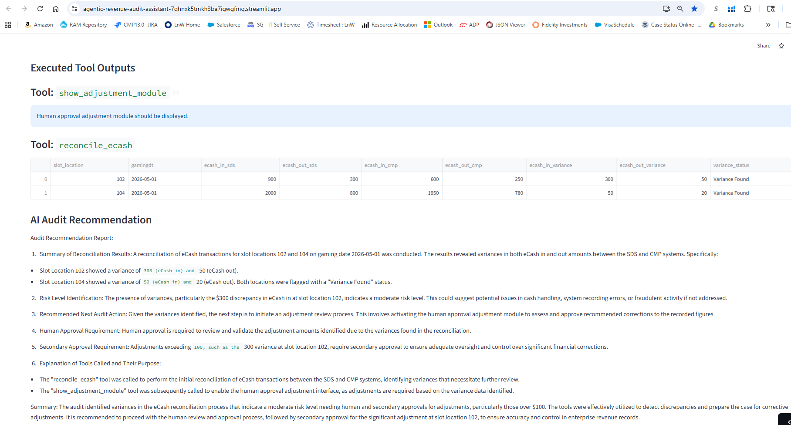
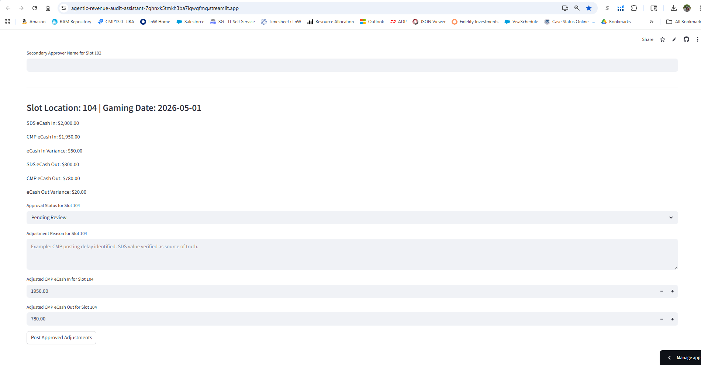
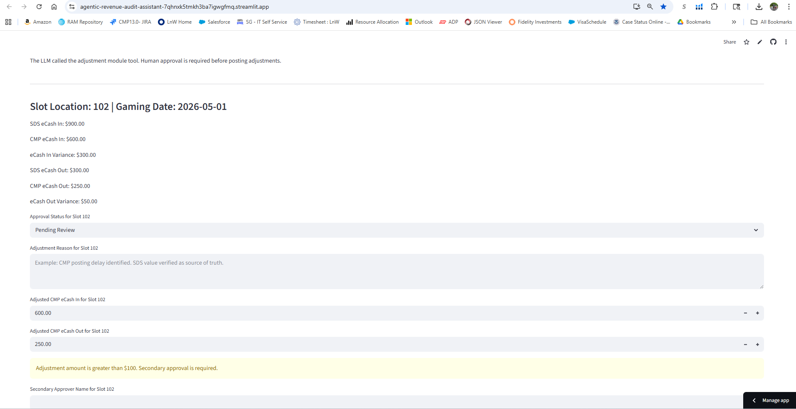

# Agentic Revenue Audit Assistant

## Overview

This project demonstrates an enterprise-style Agentic AI workflow for casino revenue audit operations.

The application uses:
- OpenAI LLM tool calling
- deterministic reconciliation tools
- SOP-grounded Retrieval-Augmented Generation (RAG)
- workflow orchestration
- human-in-the-loop governance controls

The AI agent interprets auditor requests, determines which tools to execute, retrieves audit SOP guidance, identifies reconciliation variances, invokes approval workflows, and supports governed adjustment posting.

This project simulates how enterprise AI systems orchestrate workflows while maintaining financial controls and human approval requirements.

---
## Live Demo

[Streamlit Live Application](https://agentic-revenue-audit-assistant-7qhnxk5tmkh3ba7igwgfmq.streamlit.app/)

## Business Problem

Revenue audit teams in casino operations must reconcile financial data across multiple systems such as:
- SDS (Slot Data System)
- CMP (Casino Management Platform)

Traditional reconciliation processes are:
- manual
- spreadsheet-driven
- operationally expensive
- error-prone
- difficult to govern at scale

Auditors must:
- identify variances
- review audit policies
- validate adjustments
- capture approvals
- enforce governance rules
- rerun reconciliation workflows

This project demonstrates how an Agentic AI workflow can modernize revenue audit operations while preserving enterprise governance and financial controls.

---

## Key Features

- LLM-driven tool orchestration
- Deterministic eCash reconciliation tool
- SOP retrieval using RAG
- AI-generated audit recommendations
- Human-in-the-loop approval workflow
- Adjustment validation controls
- Secondary approval workflow for adjustments greater than $100
- Governance-aware adjustment posting
- Downloadable adjustment audit logs
- Session-aware workflow state management
- Streamlit UI for interactive workflow execution

---

## AI Architecture Pattern

This project demonstrates an enterprise Agentic AI architecture pattern.

### Architecture Flow

Auditor Request
        ↓
LLM Agent
        ↓
Tool Selection
 ├── reconcile_ecash
 ├── retrieve_sop
 └── show_adjustment_module
        ↓
Python Orchestration Runtime
        ↓
Tool Execution
        ↓
Tool Outputs Returned to LLM
        ↓
LLM Audit Recommendation
        ↓
Human Approval Workflow
        ↓
Governance Validation
        ↓
Adjustment Posting

---

## Architecture Diagram

## Application Screenshots

### Reconciliation Workflow

The AI agent reconciles SDS and CMP eCash data using deterministic reconciliation tools.

---

### LLM Tool Calling

The LLM agent dynamically selects tools based on auditor intent.

Example tools:
- reconcile_ecash
- retrieve_sop
- show_adjustment_module

---

### AI Audit Recommendation

The AI assistant retrieves SOP guidance and generates governance-aware audit recommendations.

---

### Human Approval Adjustment Workflow

The adjustment workflow supports:
- human approval
- adjustment reason capture
- CMP adjustment validation
- governance enforcement

---

### Secondary Approval Governance

Adjustments greater than $100 require secondary approver validation before posting.

## Agentic Workflow Design

Unlike traditional AI-assisted workflows where Python controls the execution sequence, this project demonstrates:

LLM-driven workflow orchestration

The LLM determines:
- which tools should be executed
- when SOP retrieval is required
- when adjustment workflow should be invoked
- when human approval is required
- when governance escalation is necessary

The orchestration runtime executes the selected tools and returns results back to the LLM for reasoning.

---

## Deterministic Financial Controls

Financial calculations are intentionally separated from the LLM.

### Important Design Principle

The LLM does NOT:
- calculate revenue totals
- calculate variances
- modify financial values

All reconciliation calculations are performed by deterministic Python/Pandas tools.

This approach improves:
- auditability
- governance
- financial accuracy
- enterprise compliance
- operational trust

---

## RAG Implementation

The project uses SOP-grounded Retrieval-Augmented Generation (RAG).

### Knowledge Base

knowledge_base/ecash_audit_sop.txt

The LLM retrieves:
- audit SOP guidance
- approval rules
- governance requirements
- escalation policies

before generating recommendations.

---

## Human-in-the-Loop Governance

The system enforces enterprise governance controls.

### Governance Rules

- Human approval required before posting adjustments
- Adjustment reasons must be captured
- Adjusted CMP values must match SDS values
- Secondary approver required for adjustments greater than $100
- Audit timestamps and committed user captured
- AI recommendations are advisory only

---

## Tool Calling Architecture

The LLM dynamically selects tools based on auditor intent.

### Available Tools

| Tool | Purpose |
|---|---|
| `reconcile_ecash` | Compare SDS and CMP data and identify variances |
| `retrieve_sop` | Retrieve audit SOP guidance |
| `show_adjustment_module` | Trigger human approval adjustment workflow |

---

## Example Auditor Requests

Please reconcile today's eCash audit.

Reconcile the eCash audit and retrieve the SOP guidance.

Show me the adjustments to be made.

Review variance records and open the approval workflow.

---

## Sample Data Format

### SDS eCash File

csv
slot_location,gamingdt,ecash_in,ecash_out
101,2026-05-01,1200,500
102,2026-05-01,900,300
103,2026-05-01,1500,700
104,2026-05-01,2000,800

### CMP eCash File

csv
slot_location,gamingdt,ecash_in,ecash_out
101,2026-05-01,1200,500
102,2026-05-01,900,250
103,2026-05-01,1500,700
104,2026-05-01,1950,780

---

## Technologies Used

- Python
- Streamlit
- Pandas
- OpenAI API
- python-dotenv

---

## How to Run the Application

### Install Dependencies

py -m pip install -r requirements.txt

### Configure Environment Variable

Create a `.env` file:

OPENAI_API_KEY=your_api_key_here

### Run Application

py -m streamlit run app.py

---

## Repository Structure

agentic-revenue-audit-assistant/
│
├── app.py
├── requirements.txt
├── README.md
├── .env
├── .gitignore
│
├── data/
│   ├── sds_ecash.csv
│   └── cmp_ecash.csv
│
├── knowledge_base/
│   └── ecash_audit_sop.txt
│
├── assets/
│   ├── reconciliation-screen.png
│   ├── tool-calling-screen.png
│   └── adjustment-module-screen.png
│
└── architecture/
    └── agentic-workflow-diagram.png

---

## Enterprise AI Concepts Demonstrated

- Agentic AI workflow orchestration
- LLM tool calling
- Deterministic financial processing
- Retrieval-Augmented Generation (RAG)
- Human-in-the-loop governance
- Approval workflow orchestration
- Enterprise audit controls
- AI governance and compliance
- Operational AI design
- Workflow state management

---

## Skills Demonstrated

- AI Solution Architecture
- Agentic Workflow Design
- Revenue Audit Automation
- AI Governance
- Tool-Oriented AI Design
- Enterprise Workflow Orchestration
- OpenAI Integration
- Python Development
- Streamlit Application Development
- Technical Program Management
- Financial Systems Thinking

---

## Future Enhancements

- LangGraph orchestration
- Multi-agent coordination
- Vector database integration
- Conversational audit memory
- Real-time reconciliation engine
- Database integration
- Role-based access control
- Escalation management workflow
- Enterprise reporting dashboard
- Cloud deployment architecture
- Autonomous retry orchestration
- MCP integration

---

## Author

Gowrishankar Sivalingappa, PMP

AI TPM | Revenue Systems | AI Automation | Gaming Operations
